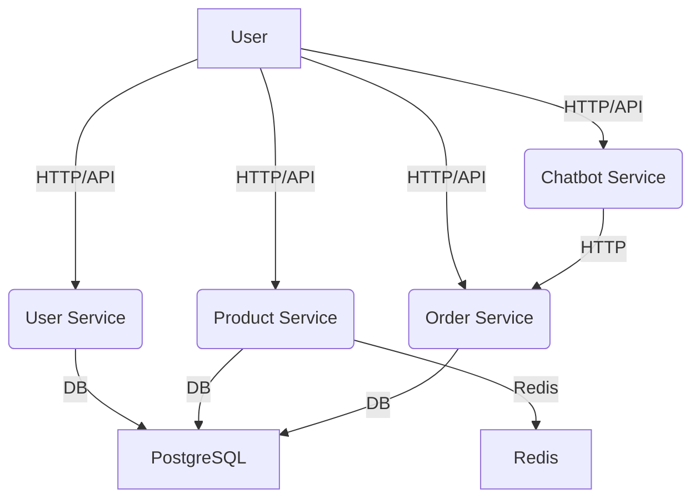
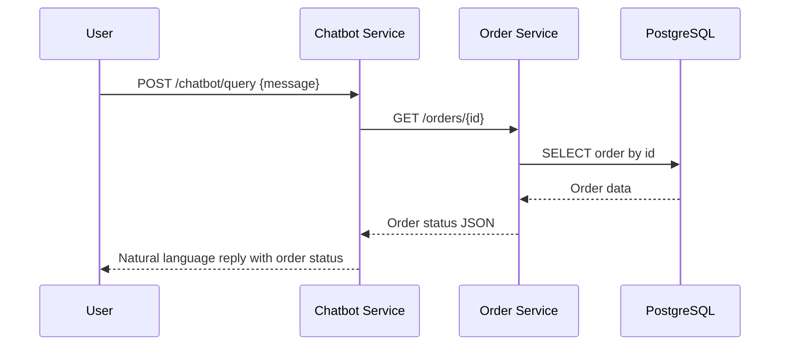

# SFConnect Backend Technical Design Document (TDD)

## Introduction

SFConnect is a modular backend system designed to support a scalable, multi-role e-commerce platform. The project demonstrates best practices in Go microservices, authentication, caching, DevOps, and documentation.

## Goals & Objectives

- Provide robust user, product, order, and chatbot services.
- Ensure secure authentication and role-based authorization.
- Enable efficient product caching and order management.
- Support maintainable, testable, and deployable code.

## Architecture

### Sequence: Chatbot Order Status Query

- **Microservices:**
  - `user-service`: User registration, login, profile, roles.
  - `product-service`: Product CRUD, Redis caching.
  - `order-service`: Order creation, status, commission, business logic.
  - `chatbot-service`: NLU, order status Q&A.
- **Data Flow:**
  - Users interact via HTTP APIs (Gin).
  - Chatbot queries order-service for real-time order status.
  - Product-service caches product data in Redis.
- **Diagram:** See above Mermaid diagrams for a high-level and sequence overview.

## Technology Stack

- Go 1.22, Gin, PostgreSQL, Redis, Docker, GitHub Actions, Swagger/OpenAPI.
- Chosen for performance, ecosystem, and cloud-native support.

## Detailed Design

### User Service

- **API:** `/register`, `/login`, `/me`, `/users/{id}/role` (admin)
- **DB:** `users` table (id, email, password_hash, full_name, role, ...)
- **Auth:** JWT, bcrypt, role-based middleware.
- **Testing:** Unit and integration tests for all endpoints.

### Product Service

- **API:** `/products` CRUD
- **DB:** `products` table (id, name, price, partner_id, ...)
- **Cache:** Redis cache-aside for product details, invalidation on update/delete.
- **Testing:** CRUD and cache logic tested.

### Order Service

- **API:** `/orders`, `/orders/{id}`, `/orders/my-orders`, status transitions, commission.
- **DB:** `orders`, `order_items`, `commission` field.
- **Logic:** Status transitions, commission calculation, partner/buyer/admin flows.
- **Testing:** Unit/integration tests for all flows.

### Chatbot Service

- **API:** `/chatbot/query` (POST)
- **NLU:** Regex-based order ID extraction.
- **Integration:** Calls order-service for status, returns natural language reply.
- **Testing:** Extraction and integration tested.

## Authentication & Authorization

- JWT-based auth, role-based access for sensitive endpoints.
- Middleware injects user/role into Gin context.

## Caching Strategy

- Product-service uses Redis for product details.
- Cache-aside pattern, invalidation on update/delete.

## Error Handling

- Consistent JSON error responses.
- Custom error types for business logic.

## Deployment Strategy

- Docker Compose for local/dev.
- Multi-stage Dockerfiles for small images.
- GitHub Actions for CI/CD.
- (Kubernetes: future consideration.)

## Testing Approach

- Unit tests for business logic and utils.
- Integration tests for all API endpoints.
- Load testing with ab/Postman.

## Future Improvements

- Advanced NLU in chatbot (intent classification).
- Partner assignment automation.
- More granular permissions.
- Production-grade monitoring/logging.
- Kubernetes deployment.

---

For full API details, see Swagger docs in each service's `/docs` folder and linked in the main README.
